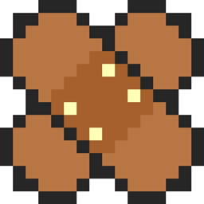
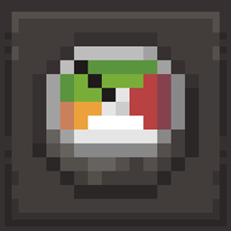
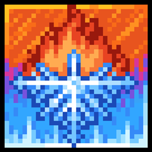

# DCM:Expansion - Forge mod (for Minecraft 1.18.2)

### This is a mod written for my private modpack DeceasedCraft:Modified(DCM), modified from TqLxQuanZ's [DeceasedCraft](https://www.curseforge.com/minecraft/modpacks/deceasedcraft)

 

# Dependencies

This mod requires [First Aid](https://legacy.curseforge.com/minecraft/mc-mods/first-aid) to run

This mod requires [Atlas Lib](https://legacy.curseforge.com/minecraft/mc-mods/atlas-lib) and [The Hordes](https://legacy.curseforge.com/minecraft/mc-mods/the-hordes) to run

This mod requires [Framework](https://legacy.curseforge.com/minecraft/mc-mods/framework) for custom models

The rest are all OPTIONAL dependencies

  

 

## Contents and Features

- You can configure this mod in your save file, located in *serverconfig/dcmexpansion-server.toml*
- Medical related contents such as First-Aid kit, Adrenaline, Infection Serum etc
- Immersive Aircraft upgrades with overpowered stats
- Other mod integration items...

## Future plans?

- Many mod-integration items (for custom crafting recipes) pretty much most of them for general pack-integration
- TAC:Zero addon with custom items, I'm already working on it (custom guns will be from DooM Eternal series)
- Plasma Melee Weapons for Better Combat mod

***The ported TAC bullet-proof vests are originaly made by TAC team, I do not own any of them***

***The rest of the models are all made by me, please do not claim it yourself***

**You can use this mod in your modpack as long as you don't claim this mod yourself**

